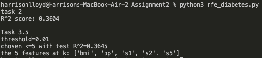

# MATH/CSCI 485 Assignment 2: RFE with Linear Regression

## Description
This project implements Recursive Feature Elimination (RFE) on the diabetes dataset to identify the most important features for predicting disease progression.

## Requirements
- Python 3.x
- pandas
- scikit-learn
- matplotlib

## Installation
Install required packages:
```bash
pip install pandas scikit-learn matplotlib
```

## How to Run
Execute the Python script:
```bash
python3 rfe_diabetes.py
```

Running this command will automatically generate all visualizations and tables if they haven't been created already.

## Generated Outputs
The code will generate the following files:
1. **rfe_r2_by_k.csv** - Table showing R^2 scores and selected features for each k value
2. **rfe_coefficients_by_k.csv** - Coefficient values for each feature at each iteration
3. **rfe_r2_vs_k.png** - Visualization of R^2 score vs. number of features

The terminal will also display:
- Baseline R^2 score (Task 2)
- Optimal k selection with threshold information (Task 3.5)

## Example Output

